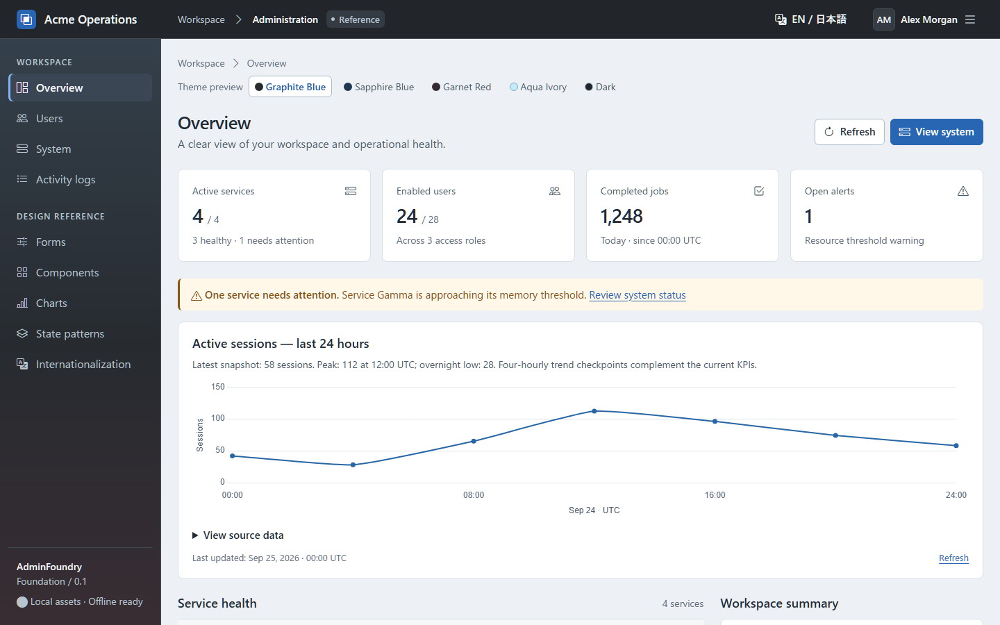
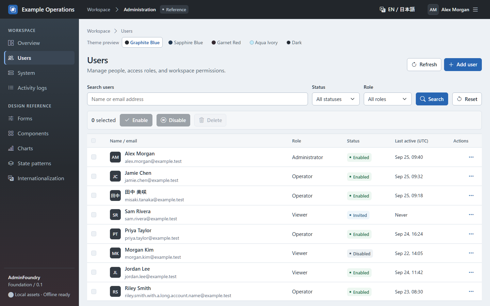
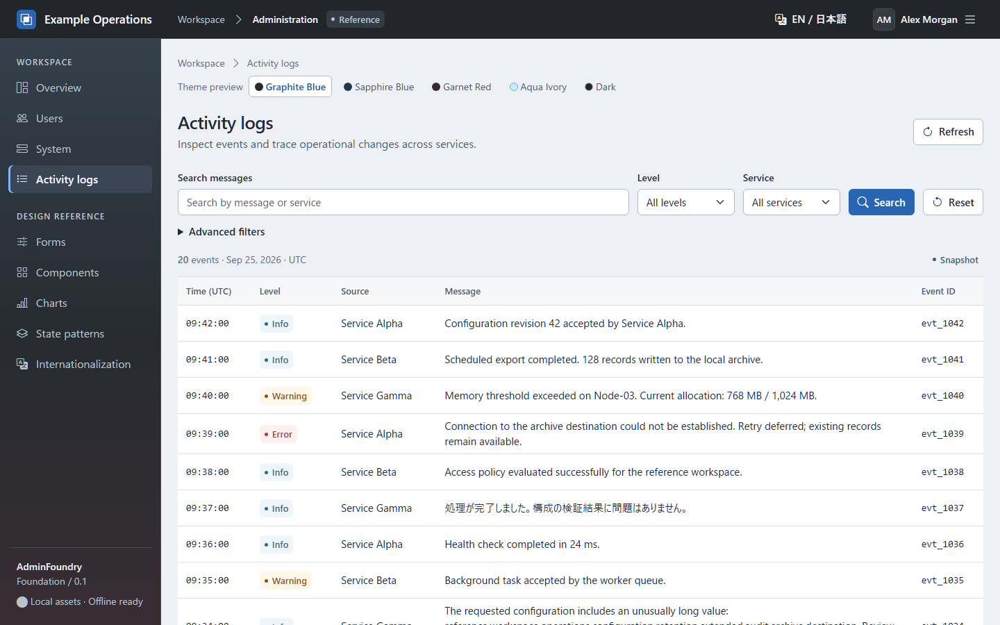

[English](README.md) | [日本語](README.ja.md)

# AdminFoundry

サーバー側でHTMLを描画するWebアプリ向けの、現代的な管理UIパターン集です。

AdminFoundryは、PHP、ASP.NETなどのPOSTバック型アプリに向けた、オフライン対応の管理UIデザインシステムとCodex Skillです。CDNは不要です。

**[Live Demoを見る](https://masapomu.github.io/admin-foundry/)** · [Reference UIを開く](https://masapomu.github.io/admin-foundry/demo/dashboard.html)

デザインシステム、実装の基準となるHTML/CSS/JavaScriptのReference UI、`server-rendered-admin-ui` Skillをひとつにまとめています。Bootstrap 5.3.xとBootstrap Iconsを使い、通常のページ遷移、GETフィルター、POSTフォーム、Post/Redirect/Getを保ちながら管理画面を整えます。

現代的なUIを作るために、React、SPA、クライアント側ルーター、実行時のNode、CDNが必須とは限りません。対象はPHP、ASP.NET/Razor、Perl、Pythonなど、サーバーでHTMLを描画するアプリです。JavaScriptは画面を補助し、ルーティング、データ、認証、CSRF、検証、翻訳はホストアプリが担当します。

## Codexへのインストール方法

このリポジトリのPluginカタログを追加し、AdminFoundryをインストールします。

```text
codex plugin marketplace add masapomu/admin-foundry --ref main
codex plugin add admin-foundry@admin-foundry-local
```

新しいCodexタスクを開始し、`admin-foundry:server-rendered-admin-ui` Skillを使ってサーバー描画の管理UIを設計・実装・レビューするよう依頼してください。SkillとReference UIはPluginに同梱されており、Skillを別途インストールする必要はありません。このリポジトリのカタログはGitHubから直接導入するためのもので、公式公開Pluginディレクトリへの掲載ではありません。

## Preview

Showcaseから、実装の基準となるReference UIを静的Demoとして試せます。操作は模擬動作で、データを保存したりバックエンドへ送信したりしません。

### Dashboard



### User administration



### Dense log view



[Live Demoを開く →](https://masapomu.github.io/admin-foundry/)

## 基本原則

- サーバー描画HTMLを優先し、Bootstrap 5.3.x、Bootstrap Icons、Vanilla JavaScriptを使用します。
- Progressive Enhancementを採用します。SPAやクライアント側ルーターは不要です。
- アセットをローカルに同梱でき、CDNなしで完全にオフライン運用できます。
- i18nは必須です。英語をフォールバックとし、共有JavaScriptへ画面表示用の英文を固定しません。
- アクセシビリティを考慮したデスクトップ中心の画面で、狭幅やJavaScript無効時にも利用できます。

## Reference UI

[Referenceページ](skills/server-rendered-admin-ui/assets/reference-ui/index.html)には、ログイン、Dashboard/KPI、Users/CRUDテーブル、Systemの稼働状態、密度の高いLogsとフィルター、Formsと検証、Bootstrap Components、読み込み・空・エラー状態、i18n、任意のChartsが含まれます。詳細、ページ送り、送信結果、アカウント設定のページで一連の流れも確認できます。自作のCSSとJavaScriptはHTMLとともに `skills/server-rendered-admin-ui/assets/` に置いています。

`skills/server-rendered-admin-ui/assets/reference-ui/index.html` をブラウザーで開くか、任意のローカル静的サーバーで配信してください。vendorアセットを同梱しているため、インターネット、Node/npmのビルド、バックエンドなしで表示できます。デモ操作は模擬動作で、データの保存や削除はしません。実アプリへ適用するときはReferenceのHTML/CSSを出発点とし、模擬処理をサーバー側の処理へ置き換えてください。

## SkillとPlugin

**Plugin:** AdminFoundry (`admin-foundry`)

**Skill:** [server-rendered-admin-ui](skills/server-rendered-admin-ui/SKILL.md)

Skillは**Design**、**Implement**、**Review**に対応します。作業に関係するReferenceページと規約だけを読む構成なので、Users画面の作業で全文書・全ページを読み込む必要はありません。ルートの [plugin.json](plugin.json) がportable Agent Plugins形式のmanifestで、`.codex-plugin/plugin.json` はCodex向けの互換用です。MCPサーバー、アカウント接続、外部APIを持たないskills-only Pluginです。

プロジェクトの事実情報は英語版 [README.md](README.md) を正本とします。変更時には、この日本語版も意味が揃うよう更新してください。

### 利用例

**Design**

```text
AdminFoundryを使って、サーバー描画の管理コンソールを設計してください。

製品: Example Operations
テーマ: Graphite
アクセント: Blue

ページ:
- Dashboard
- Users
- Nodes
- Logs
```

**Implement**

```text
AdminFoundryのserver-rendered-admin-ui Skillを使い、このPHPのUsersページを実装してください。
既存のGET/POST構成を維持し、同梱のUsers Referenceを見た目の基準にしてください。
```

**Review**

```text
この管理UIをAdminFoundryのデザインシステムとcanonical Reference Implementationに照らしてレビューしてください。
見た目の一貫性、i18n、アクセシビリティ、オフライン依存関係、サーバー描画の構成を確認してください。
```

## アーキテクチャと多言語対応

```text
サーバーアプリ -> 描画済みHTML -> Bootstrap + AdminFoundryのスタイル
                                 |-> Bootstrap Icons
                                 `-> Vanilla JavaScriptによる補助動作
```

翻訳ランタイムと日時・数値の言語別整形はホストアプリが担当します。言語は、ユーザーの明示的な選択、保存済み設定、HTTP `Accept-Language`、英語の順に決めます。UTF-8と`<html lang>`を設定してください。AdminFoundryの共有JavaScriptは翻訳済みラベルをHTMLから受け取り、画面表示用の英文を固定しません。

実行時の依存ファイルはローカルにまとめられるため、イントラネットやサーバー管理ツールでも使用できます。ReferenceにはBootstrapとBootstrap Iconsをローカル同梱しています。Chart.jsは任意で、データの理解に役立つページだけで読み込みます。Dashboardだからといってグラフは必須ではありません。

## リポジトリ構成

```text
plugin.json                         portable Plugin manifest
.codex-plugin/plugin.json           Codex互換用manifest
skills/server-rendered-admin-ui/
  SKILL.md                          作業手順とReferenceの案内
  references/                       デザイン・実装の規約
  assets/
    reference-ui/                   canonical HTMLページ
    css/                            自作のデザイントークンとChartスタイル
    js/                             自作の補助動作とデモ用スクリプト
    vendor/                         オフライン用の第三者配布物とライセンス
LICENSE                             自作部分のMITライセンス
THIRD-PARTY-NOTICES.md              依存ライブラリの版とライセンス
tests/                              保守用検証。実行時には不要
site/                               ShowcaseのLandingとartifact組み立てスクリプト
docs/images/                        READMEとShowcaseのスクリーンショット
.github/workflows/pages.yml         GitHub Pagesのartifact・デプロイworkflow
```

現在は**0.1.5のプレリリース**で、Plugin Directoryには未公開です。Bootstrap、Bootstrap Icons、Chart.jsと関連ライブラリのライセンスは [THIRD-PARTY-NOTICES.md](THIRD-PARTY-NOTICES.md) を参照してください。AdminFoundryの自作コードと文書は [MITライセンス](LICENSE) で、第三者配布物にはそれぞれのライセンスが適用されます。

Pagesと同じartifactをローカルで確認するには、新しいcheckoutで `pwsh -File site/build-pages.ps1` を実行し、`.work/pages/` を任意の静的サーバーで配信してください。スクリプトはcanonical Reference UIとローカルのCSS、JavaScript、アイコン、vendorアセットを一時的な公開ディレクトリへコピーします。ソースは一か所のままです。ShowcaseはGitHub Actionsによって [masapomu.github.io/admin-foundry](https://masapomu.github.io/admin-foundry/) に公開されています。
